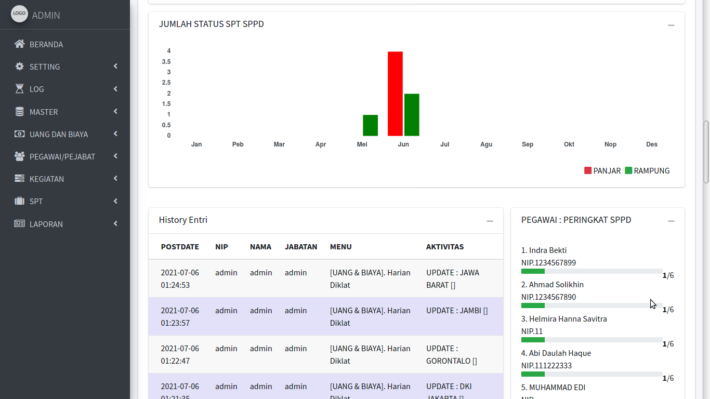
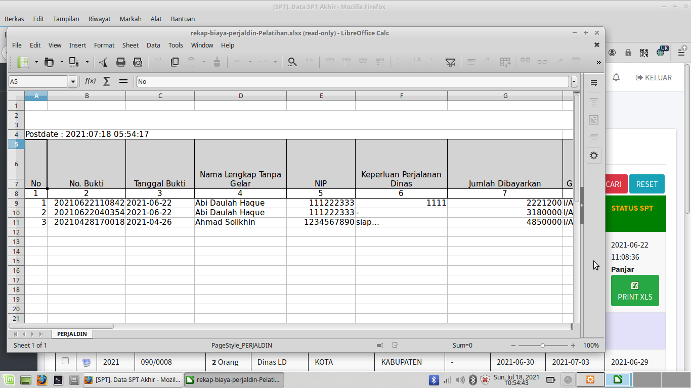

# sisfo-SPPD

SISFO-SPPD v1.0 : Sistem Informasi Surat Perintah Perjalanan Dinas. 

Cocok untuk kantor - kantor yang membutuhkan pengarsipan surat perintah tugas perjalanan dinas.

Dibuat dan dites dengan WebServer XAMPP PHP 7.4 . Pada LinuxMint.

---

FITUR :

- Data Master Pegawai/Pejabat.

- Setting Anggaran Murni, Anggaran Perubahan, Realisasi Anggaran, Tarif Hotel/Penginapan, Driver/Sopir, Harian Diklat, Representasi, Transportasi Darat, Dari Bandara.

- Setting Pejabat Pemberi Perintah dan Tanda Tangan SPPD.

- Setting Kegiatan Anggaran.

- Deteksi GPS posisi terakhir Pegawai yang mendapatkan SPPD via aplikasi android.

- Entri Data SPT / Surat Perintah Tugas.

- Tujuan SPPD dalam daerah, tujuan pertama dan tujuan kedua.

- Set Status SPT : Panjar/Rampung

- Set Pegawai untuk suatu SPT, Kontribusi dan Akomodasinya.

- Unggah File berkas jpg/jpeg/pdf/png/doc/docx untuk bukti SPT.

- Unduh .xls Rincian Biaya Perjalanan Dinas

- Unduh .xls Kwitansi

- Laporan per Orang

- Laporan per Bagian

- Laporan per Bagian & Bulan

- Laporan per Bagian & Tahun

- Laporan per Golongan/Ruang

- Laporan per Golongan/Ruang & Bulan

- Laporan per Golongan/Ruang & Tahun

- Laporan per Jenis Perjalanan

- Laporan per Bulan Perjalanan

- Laporan per Dalam Daerah

- Laporan per Luar Daerah

- Laporan per Jabatan & Bulan

- Laporan per Jabatan & Tahun

- Laporan per Pegawai/Pejabat

- Versi Android untuk Presensi Pegawai/Pejabat dan Rincian SPP yang dimiliki.

---

TAMPILAN / SKRINSUT :  

 

 

 

 

 

 

 

 

 

 

 

 

 

 

 

 

 

---

INSTALASI DAN KONFIGURASI :  

1. Ekstrak file web ke folder web webserver www atau htdocs

2. Untuk konfigurasi, bisa set di file /inc/config.php

3. Jalankan phpmyadmin, buatlah sebuah database. dan lakukan import file database .sql, ada di folder /db

4. Jalankan SISFO-SPPD sesuai alamat web yang ada.

---

CONTOH AKSES USER ADMIN :

User : admin  

Pass : admin

---

CONTOH AKSES USER PEGAWAI :

User : 111222333

Pass : 111222333

---

NB. 

DEMO ONLINE atau ingin request custom konten berbayar, silahkan bisa hubungi : 

hp/sms/wa : 081-829-88-54 

atau email : hajirodeon@gmail.com

